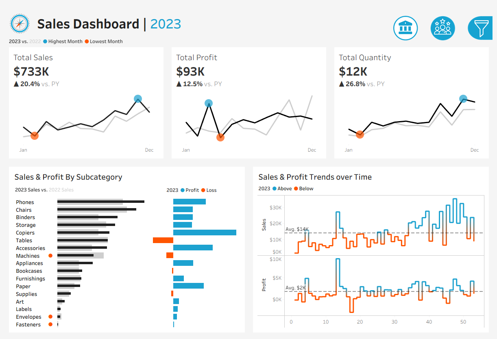
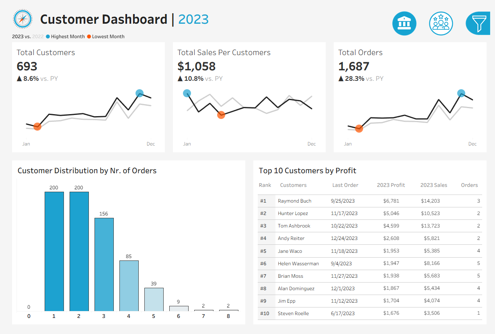

[README.md](https://github.com/user-attachments/files/31760901/README.md)
<div align="center">

# 🛒 Sales & Customer Dashboards (Dynamic)

### A Two-Page Tableau Workbook with Parameter-Driven Year-over-Year Analysis


</div>

---

## 📑 Table of Contents

- [Overview](#-overview)
- [Dashboard Preview](#️-dashboard-preview)
- [Dataset](#️-dataset)
- [Dashboards](#-dashboards)
- [Dynamic Year Parameter & YoY Logic](#-dynamic-year-parameter--yoy-logic)
- [Data Model](#️-data-model)
- [Key Insights](#-key-insights)
- [Tools & Techniques](#️-tools--techniques)
- [Project Structure](#-project-structure)
- [How to Use](#-how-to-use)
- [Contact Me](#-contact-me)

---

## 📌 Overview

**Sales & Customer Dashboards (Dynamic)** is a Tableau workbook (`.twbx`) built on the classic Superstore retail dataset. It's split into two connected dashboards — **Sales** and **Customer** — that share the same navigation bar and the same trick underneath: every KPI card is **parameter-driven**, so a single Year selector recalculates Current-Year vs. Prior-Year figures, growth %, and peak highlighting across every chart at once.

Rather than static totals, the workbook is built around **178 calculated fields** — current/prior-year splits, YoY growth ratios, LOD (`FIXED`) expressions, and table calculations (`WINDOW_MAX`, `WINDOW_AVG`) that automatically flag the best-performing point on every trend line and bar chart.

---

## 🖼️ Dashboard Preview

<div align="center">

### 💰 Sales Dashboard (2023)



<br/><br/>

### 👥 Customer Dashboard (2023)



</div>

**Sales Dashboard, 2023 vs. 2022:**

| Metric | 2023 Value | YoY Change |
|---|---|---|
| Total Sales | **$733K** | ▲ 20.4% |
| Total Profit | **$93K** | ▲ 12.5% |
| Total Quantity | **12K units** | ▲ 26.8% |

**Customer Dashboard, 2023 vs. 2022:**

| Metric | 2023 Value | YoY Change |
|---|---|---|
| Total Customers | **693** | ▲ 8.6% |
| Total Sales per Customer | **$1,058** | ▲ 10.8% |
| Total Orders | **1,687** | ▲ 28.3% |

Each KPI card carries its own **Jan–Dec sparkline** with the highest and lowest month of the year auto-flagged. The `Top 10 Customers by Profit` table shows **Raymond Buch** in the #1 spot with $6,781 profit from just 3 orders, and the `Customer Distribution by Nr. of Orders` histogram shows most customers (roughly 400 of 693) ordered only once or twice in 2023 — while just 2 customers placed 8 orders.

---

## 🗃️ Dataset

Built on the well-known **Sample Superstore** dataset, split into four relational tables.

| Table | Rows | Description |
|---|---|---|
| `Orders.csv` | 9,994 | Every order line: order/ship date, ship mode, customer, product, sales, quantity, discount, and profit |
| `Customers.csv` | 793 | Customer ID and name |
| `Location.csv` | 632 | Postal code, city, state, region, and country |
| `Products.csv` | 1,894 | Product ID, category, sub-category, and product name |

**Verified scope of the data:**
- 📅 Orders span **2020-01-03 to 2023-12-30** — four full years, which is exactly what the Year parameter drives
- 💰 Total Sales: **$2,297,200.86** · Total Profit: **$286,397.02** · Total Quantity: **37,873 units**
- 🧾 **5,009** distinct orders from **793** customers
- 🌍 Covers all of the **United States** — 4 regions (Central, East, South, West), 49 states, 531 cities
- 🏷️ **3** product categories (Furniture, Office Supplies, Technology) across **17** sub-categories and 1,862 unique products

---

## 📊 Dashboards

### 💰 Sales Dashboard
| KPI Cards | Supporting Visuals |
|---|---|
| `KPI Sales`, `KPI Profit`, `KPI Quantity` — each with its own Jan–Dec sparkline, YoY % change, and the highest/lowest month auto-flagged | `Subcategory Comparison` — 2023 vs. 2022 sales by sub-category, paired with a `Profit / Loss` bar showing which sub-categories were profitable in 2023<br>`Weekly Trends` — weekly Sales and Profit, shaded **Above**/**Below** the yearly weekly average |

### 👥 Customer Dashboard
| KPI Cards | Supporting Visuals |
|---|---|
| `KPI Customers`, `KPI Sales Per Customers`, `KPI Orders` — each with its own Jan–Dec sparkline, YoY % change, and the highest/lowest month auto-flagged | `Customer Distribution` — a histogram of customers by number of orders placed (loyalty/repeat-purchase view)<br>`Top Customers` — ranked table of the top 10 customers by profit, with last order date, sales, and order count |

Both dashboards share the same layout skeleton — a title bar, a horizontal KPI strip, a filter panel, and a two-chart body — plus a **navigation button** (with distinct active/inactive icon states) that lets the viewer flip between the two pages without leaving the workbook.

---

## 🎛️ Dynamic Year Parameter & YoY Logic

The whole workbook pivots on a single control: **`Parameter 1`** (the selected year, defaulting to 2023). Every KPI is built from a pair of calculated fields such as:

```
CY Sales  = IF YEAR([Order Date]) = [Parameters].[Parameter 1]   THEN [Sales] END
PY Sales  = IF YEAR([Order Date]) = [Parameters].[Parameter 1]-1 THEN [Sales] END

YoY Growth % = (SUM([CY Sales]) - SUM([PY Sales])) / SUM([PY Sales])
```

The same Current-Year / Prior-Year pattern powers Profit, Quantity, Customers (via `COUNTD`), Orders, and Sales-per-Customer — meaning **changing one parameter instantly refreshes every KPI card and chart on both dashboards.**

On top of that, table calculations do the visual storytelling automatically:
- `WINDOW_MAX(...)` / `WINDOW_MIN(...)` flag the highest and lowest month on every KPI sparkline, so the peak and the dip are visible at a glance without manual formatting
- `WINDOW_AVG(...)` on the `Weekly Trends` chart shades each week **Above** or **Below** the yearly weekly average (avg. $14K/week for Sales, $2K/week for Profit in 2023)
- A **Profit / Loss** color split on the `Subcategory Comparison` chart instantly flags which sub-categories lost money in the selected year (e.g. Machines, Envelopes, and Fasteners in 2023)

---

## 🗺️ Data Model

The four tables relate through simple keys, forming a clean, denormalized retail model:

```
Customers.csv ──(Customer ID)──┐
                                ├──> Orders.csv <──(Product ID)── Products.csv
Location.csv ───(Postal Code)──┘
```

- `Orders` is the fact table — every other table enriches it with descriptive attributes
- `Customers` adds the customer name behind each `Customer ID`
- `Location` adds city/state/region/country behind each `Postal Code`
- `Products` adds category/sub-category/name behind each `Product ID`

---

## 💡 Key Insights

- Four full years of data (2020–2023) let the dynamic parameter genuinely compare year-over-year performance, not just a single snapshot. With the parameter set to **2023**, Sales grew **20.4%**, Profit **12.5%**, and Quantity **26.8%** versus 2022.
- Growth is even stronger on the customer side in 2023: Total Orders were up **28.3%** year-over-year — outpacing the 8.6% growth in customer count, meaning existing customers are ordering noticeably more often, not just that there are more of them.
- The `Customer Distribution by Nr. of Orders` histogram shows a steep drop-off: roughly **400 of the 693** customers (about 58%) placed only 1–2 orders in 2023, while just 2 customers reached 8 orders — a clear signal for a loyalty or repeat-purchase campaign.
- The **Technology** and **Furniture** categories drive a disproportionate share of the **17 sub-categories**, and the `Profit / Loss` split on the Sales Dashboard flags specific sub-categories (e.g. Machines) that sold well but still lost money in 2023 — a pricing or cost problem, not a demand problem.
- The peak-highlighting logic (`WINDOW_MAX`/`WINDOW_MIN`) surfaces the single best and worst month automatically on every KPI card — no manual annotation needed as new years of data are added.

---

## 🛠️ Tools & Techniques

- **Tableau Desktop** — dashboard design, actions, and packaged workbook (`.twbx`) publishing
- **Parameters** — a single Year selector driving every dynamic calculation
- **Calculated Fields (178 total)** — Current Year / Prior Year splits, YoY growth ratios
- **LOD Expressions** — `{FIXED ...}` for calculations independent of view-level granularity
- **Table Calculations** — `WINDOW_MAX`, `WINDOW_AVG` for automatic peak and above/below-average highlighting
- **Dashboard Actions & Navigation** — button-based navigation between the Sales and Customer dashboards with active/inactive icon states

---

## 📁 Project Structure

```
Sales-Customer-Dashboards/
├── README.md
├── Sales & Customer Dashboards (Dynamic).twbx
├── Orders.csv
├── Customers.csv
├── Location.csv
├── Products.csv
└── assets/
    ├── dashboard-sales.png
    └── dashboard-customer.png
```

---

## 🚀 How to Use

1. Download `Sales & Customer Dashboards (Dynamic).twbx` from this repository — it's a packaged workbook, so the data is already embedded inside it.
2. Open it in **Tableau Desktop** or **Tableau Reader** (free viewer, no license required).
3. Use the **Year parameter** in the filter panel to switch between 2020–2023 and watch every KPI and chart update.
4. Use the navigation button at the top to flip between the **Sales Dashboard** and the **Customer Dashboard**.
5. The four source CSVs are included separately for reference or if you want to rebuild the data connection from scratch.

---

## 📬 Contact Me

<div align="center">

[](mailto:salemomar676@gmail.com)
[](https://gamma.app/docs/Copy-of-Brand-Partnership-Proposal-lrp9yrhau9gdpj1)
[](https://www.linkedin.com/in/eng-omarsalem)

</div>

---

<div align="center">

Made with 🛒 and Tableau

</div>
